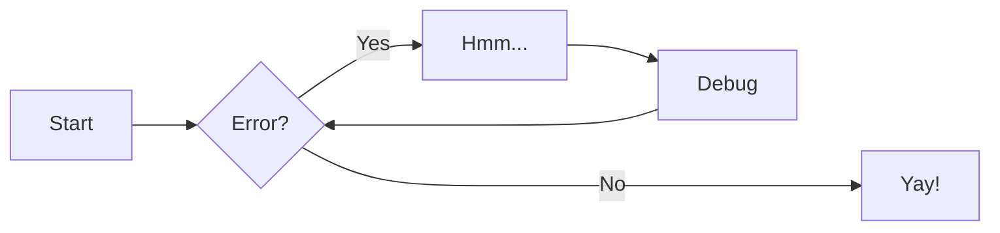
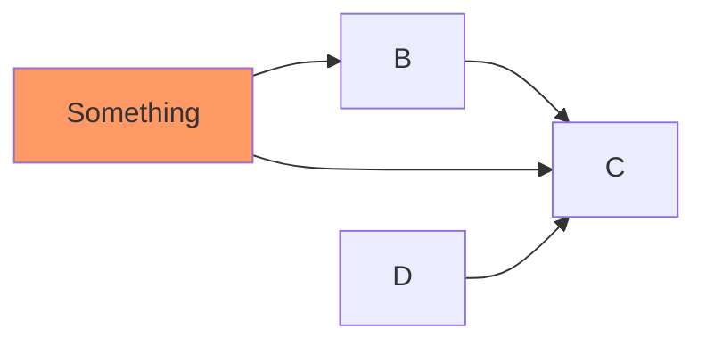

# File Input

[//]: # (This may be the most platform independent comment)
[//]: # (Grab-bag file that is not listed but shows examples)

:sparkles:

\\[
\operatorname{ker} f=\{g\in G:f(g)=e_{H}\}{\mbox{.}}
\\]

$$
\sum_{0}^{n} f(n)
$$

This is a test of $f(x) = x^2$

++ctrl+alt+del++


```python
"""speedsurprises/lists/sorting.py"""

def insertion_sort(lst: list[int]) -> list[int]:
    """Sort a list using insertion sort"""
    for i in range(1, len(lst)):
        current_value = lst[i]
        position = i

        while position > 0 and current_value < lst[position - 1]:
            lst[position] = lst[position - 1]
            position -= 1

        lst[position] = current_value
    return lst

def bubble_sort(lst: list[int]) -> list[int]:
    """Sort a list using bubble sort"""
    for num in range(len(lst) - 1, 0, -1):
        for i in range(num):
            if lst[i] > lst[i + 1]:
                temp = lst[i]
                lst[i] = lst[i + 1]
                lst[i + 1] = temp
    return lst
```

!!! note
    Lorem ipsum dolor sit amet, consectetur adipiscing elit. Nulla et euismod
    nulla. Curabitur feugiat, tortor non consequat finibus, justo purus auctor
    massa, nec semper lorem quam in massa.





For full documentation visit [mkdocs.org](https://www.mkdocs.org).

The HTML specification is maintained by the W3C and describes the HTTP approach.

--8<-- "includes/abbreviations.md"

## Commands

* `mkdocs new [dir-name]` - Create a new project.
* `mkdocs serve` - Start the live-reloading docs server.
* `mkdocs build` - Build the documentation site.
* `mkdocs -h` - Print help message and exit.

## Project layout

    mkdocs.yml    # The configuration file.
    docs/
        index.md  # The documentation homepage.
        ...       # Other markdown pages, images and other files.

--8<-- "includes/admonitions/admonish-comments.md"

--8<-- "includes/admonitions/admonish-names.md"

--8<-- "includes/admonitions/admonish-git.md"

--8<-- "includes/admonitions/admonish-resources.md"

--8<-- "includes/questions.md"
