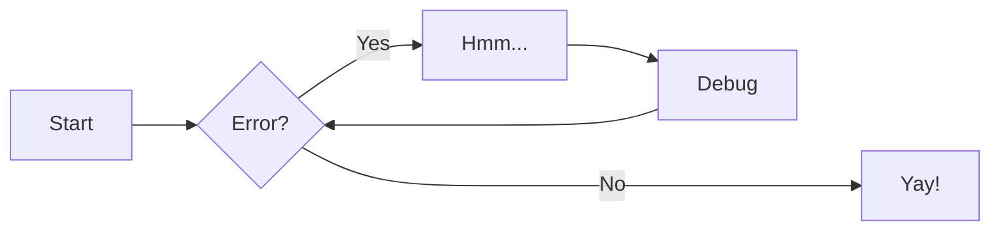
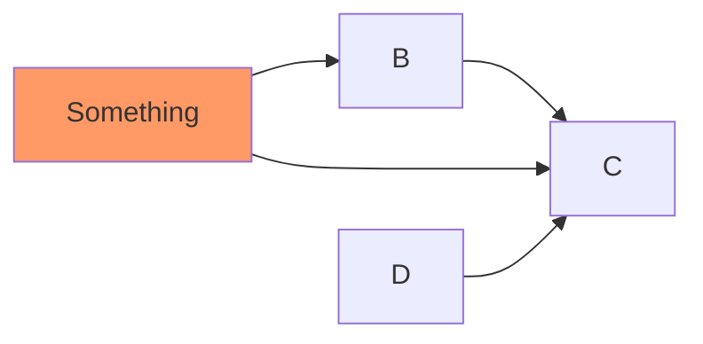

# File Input

:sparkles:

\\[
\operatorname{ker} f=\{g\in G:f(g)=e_{H}\}{\mbox{.}}
\\]

$$
\sum_{0}^{n} f(n)
$$

This is a test of $f(x) = x^2$

++ctrl+alt+del++


```python
"""speedsurprises/lists/sorting.py"""

def insertion_sort(lst: list[int]) -> list[int]:
    """Sort a list using insertion sort"""
    for i in range(1, len(lst)):
        current_value = lst[i]
        position = i

        while position > 0 and current_value < lst[position - 1]:
            lst[position] = lst[position - 1]
            position -= 1

        lst[position] = current_value
    return lst

def bubble_sort(lst: list[int]) -> list[int]:
    """Sort a list using bubble sort"""
    for num in range(len(lst) - 1, 0, -1):
        for i in range(num):
            if lst[i] > lst[i + 1]:
                temp = lst[i]
                lst[i] = lst[i + 1]
                lst[i + 1] = temp
    return lst
```

!!! note
    Lorem ipsum dolor sit amet, consectetur adipiscing elit. Nulla et euismod
    nulla. Curabitur feugiat, tortor non consequat finibus, justo purus auctor
    massa, nec semper lorem quam in massa.





